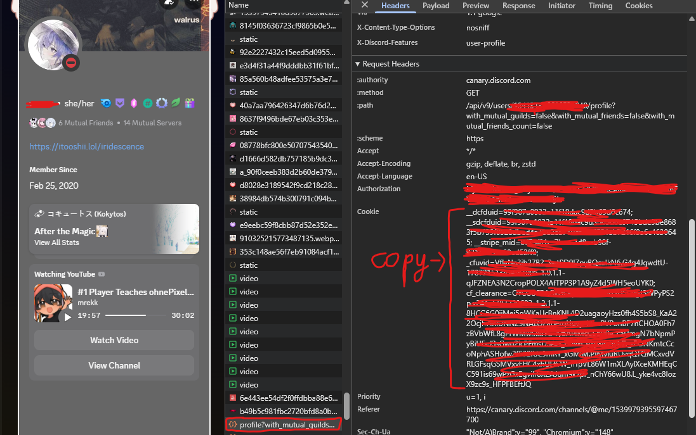

import { Image } from 'astro:assets';
import firstImage from './hero.png'


> *Script này được viết bởi **Remi**, xem mã nguồn tại [revere-group/discord-badge-spoofer](https://github.com/revere-group/discord-badge-spoofer).*
>
> *Hiện các huy hiệu mới đang trong giai đoạn thử nghiệm, vì vậy sẽ có người không thể nhìn thấy các huy hiệu này. Tuy nhiên, bạn vẫn có thể sử dụng script dù không thấy huy hiệu.*

Gần đây, Discord đã bổ sung 3 huy hiệu mới gồm **Game Time, Game Variety** và **Streaming**. Để nâng cấp các huy hiệu này, thông thường bạn sẽ phải chơi nhiều tựa game khác nhau và tích lũy một lượng thời gian khá lớn.

Nếu không muốn dành hàng nghìn giờ chỉ để hoàn thành các mốc huy hiệu, có một script cho phép giả lập dữ liệu game activity gửi đến Discord. Trong bài viết này, mình sẽ hướng dẫn cách sử dụng script đó để nâng cấp nhanh hai huy hiệu Game Time và Game Variety.

<Image
	src={firstImage}
	alt="Cover"
	priority
/>

## Tải và bật script

> ***Lưu ý:** Bạn cần cài đặt **Python** và **pip** trên máy trước khi thực hiện các bước bên dưới.*

Đầu tiên, tải toàn bộ mã nguồn của script từ [GitHub](https://github.com/revere-group/discord-badge-spoofer).

Nếu đã cài **Git**, bạn cũng có thể clone repository trực tiếp bằng lệnh:

```bash
git clone https://github.com/revere-group/discord-badge-spoofer.git
```

Sau khi tải xong, mở terminal và di chuyển vào thư mục của script:

```bash
cd discord-badge-spoofer
```

Tiếp theo, khởi động script bằng lệnh:

```bash
python spoofer.py
```

Nếu mọi thứ hoạt động bình thường, giao diện ban đầu của script sẽ hiển thị như sau:

```output
{orange}spoofer{/} {gray}·{/} discord badges
{gray}    by revere group

{gray}00:00:00 · {/}paste your discord account token
{gray}token: 
```

## Thiết lập script trước khi sử dụng

Ở bước đầu tiên, script sẽ yêu cầu **Discord account token**.

> ***Lưu ý:** Token Discord có quyền truy cập trực tiếp vào tài khoản của bạn. Không gửi token cho người khác, không đăng token lên mạng và chỉ sử dụng với mã nguồn mà bạn tin tưởng.*

Mở Discord trên trình duyệt hoặc ứng dụng Discord, sau đó mở **Developer Tools** (F12).

> *Nếu bạn chưa biết bật DevTools trên App Discord, tham khảo ở đây nhé: [Side Note: How to Enable DevTools in Discord](https://padraig.blog/side-note-how-to-enable-devtools-in-discord-on-macos/).*

Vào mục **Console** và nhập lệnh sau để lấy **token**:

```javascript
console.log(`Copy đoạn sau: ${(w=webpackChunkdiscord_app).push([[Symbol()],{},o=>{try{Object.values(o.c).some(e=>e.exports?.setToken&&(w.t=e.exports.getToken()))}catch{}}]),w.t}`)
```

Nó sẽ trả về một đoạn token dài, ví dụ:

```output
Copy đoạn sau: {orange}MTAwMDAwMDAwMDAwMDAwMDAw.MjAwMDAwMDAwMDAwMDAwMDAw.MjAwMDAwMDAwMDAwMDAwMDAw{/}
```

Sau khi lấy được token của tài khoản, copy token rồi quay lại terminal và dán vào dòng `token:`:

```output
{orange}spoofer{/} {gray}·{/} discord badges
{gray}    by revere group

{gray}00:00:00 · {/}paste your discord account token
{gray}token: {/}MTAwMDAwMDAwMDAwMDAwMDAw.MjAwMDAwMDAwMDAwMDAwMDAw.MjAwMDAwMDAwMDAwMDAwMDAw
```

Nhấn **Enter** để tiếp tục.

Sau đó, script sẽ yêu cầu bạn nhập **cf_clearance cookie header**:

```output
{orange}spoofer{/} {gray}·{/} discord badges
{gray}    by revere group

{gray}00:00:00 · {/}paste your cf_clearance cookie header
{gray}cookie:
```

Quay lại Discord, mở **Developer Tools** và chuyển sang tab **Network**. Chọn một API request của Discord, sau đó tìm mục **Request Headers** và giá trị cookie.



Copy toàn bộ giá trị cần thiết, quay lại terminal rồi dán vào dòng `cookie:`:

```output
{orange}spoofer{/} {gray}·{/} discord badges
{gray}    by revere group

{gray}00:00:00 · {/}paste your cf_clearance cookie header
{gray}cookie: {/}__dcfduid=99f907a0... (bla bla bla)
```

Nhấn **Enter** một lần nữa.

Nếu thông tin xác thực hợp lệ, script sẽ tải danh sách game và đưa bạn đến menu chính:

```output
{orange}spoofer{/} {gray}·{/} discord badges
{gray}    by revere group

{gray}00:00:00 · {/}loaded {orange}10447{/} games
{gray}00:00:00 · {/}claimed {orange}0{/} games · {orange}0h{/} total
{gray}────────────────────────────────────────────
{gray}00:00:00 · {/}{orange}1{/} · claim games
{gray}00:00:00 · {/}{orange}2{/} · refresh auth
{gray}00:00:00 · {/}{orange}3{/} · set fingerprint
{gray}00:00:00 · {/}{orange}4{/} · exit
{gray}────────────────────────────────────────────
{orange}›
```

Đến đây là quá trình thiết lập đã hoàn tất. Giờ bạn có thể bắt đầu sử dụng script để cập nhật tiến trình cho các huy hiệu.

## Sử dụng script để nâng cấp huy hiệu Discord

Tại menu chính, nhập **1** rồi nhấn **Enter** để chọn chức năng `claim games`.

Script sẽ hỏi số lượng game bạn muốn thêm:

```output
{gray}00:00:00 · {/}loaded {green}10447{/} games available
{gray}how many games? [all]: 
```

Con số này ảnh hưởng trực tiếp đến tiến trình của huy hiệu **Game Variety**.

Bạn có thể nhập một số cụ thể, chẳng hạn `100`, hoặc nhập `all` nếu muốn áp dụng cho toàn bộ list game mà script hỗ trợ.

```output
{gray}00:00:00 · {/}loaded {green}10447{/} games available
{gray}how many games? [all]:{/} 100
{gray}hours per game? [1]:
```

Tiếp theo, script sẽ hỏi số giờ muốn áp dụng cho mỗi game. Giá trị này được sử dụng để tính tiến trình cho huy hiệu **Game Time**.

Ví dụ, nếu thiết lập: **100 games** với **50 giờ mỗi game**, tổng thời gian sẽ tương đương **100 x 50 = 5000 giờ**.

Sau khi nhập số giờ và nhấn **Enter**, script sẽ bắt đầu xử lý các game đã chọn:

```output
{gray}00:00:00 · {/}claiming {orange}50h{/} on {orange}100{/} games {gray}·{/} 5000h total
{gray}────────────────────────────────────────────
{gray}00:00:00 · {/}{green}sent{/} batch 1 {gray}·{/} {green}100/100 games

{gray}00:00:00 {green}✓ {/}complete {gray}·{/} {green}100/100 games · 5000h claimed
{gray}────────────────────────────────────────────
{orange}› {/}press enter to continue
```

Khi xuất hiện dòng `complete`, quá trình gửi dữ liệu đã hoàn tất.

Giờ thì bạn có thể mở lại Discord và kiểm tra tiến trình huy hiệu của mình 😎.

## Ơ khoan, sao mình chưa thấy huy hiệu mới?

Đừng quá bất ngờ nếu huy hiệu chưa xuất hiện ngay sau khi chạy script.

Discord cần một khoảng thời gian để xử lý và cập nhật tiến trình trên tài khoản. Trong nhiều trường hợp, thay đổi có thể mất khoảng một ngày mới hiển thị, đôi khi lâu hơn.

Vì vậy, nếu vừa chạy script xong mà vẫn chưa thấy gì thay đổi thì bạn có thể kiểm tra lại sau 🐧🐧🐧.

> ***Lưu ý:** Đây không phải phương thức chính thức do Discord cung cấp. Việc giả lập activity hoặc gửi dữ liệu không phản ánh quá trình sử dụng thực tế có thể tiềm ẩn rủi ro đối với tài khoản. Hãy cân nhắc trước khi sử dụng và tuyệt đối không chia sẻ token hoặc cookie Discord của bạn cho bất kỳ ai.*

## Lời kết

Vậy là mình đã hướng dẫn xong cách sử dụng **Discord Badge Spoofer** để tăng nhanh tiến trình cho hai huy hiệu **Game Time** và **Game Variety** mà không cần phải thực sự chơi hàng trăm tựa game trong hàng nghìn giờ.

Cách thực hiện nhìn chung khá đơn giản, nhưng vì script cần sử dụng **token** và **cookie** của tài khoản Discord nên hãy luôn cẩn thận trong quá trình sử dụng. Chỉ chạy mã nguồn mà bạn tin tưởng, tuyệt đối không chia sẻ các thông tin này cho người khác và nhớ rằng đây không phải là phương thức chính thức được Discord hỗ trợ.

Chúc các bạn nâng badge thành công 🥀