> ***Lưu ý:** Những cách bên dưới có thể gây rủi ro không đáng có cho tài khoản Discord của bạn. Bạn phải tự chịu trách nhiệm nếu có bất kì vấn đề gì xảy ra.*

Discord Orbs là đơn vị điểm thưởng có thể dùng để đổi vật phẩm và nhiều phần quà thú vị trong Shop. Trong bài viết này, mình sẽ chia sẻ một số cách giúp bạn kiếm Orbs nhanh hơn, tối ưu thời gian làm nhiệm vụ và tận dụng hiệu quả những chương trình thưởng mà Discord hiện đang cung cấp.

## Công cụ tự động hoàn thành Quest (Auto Quest Completion)
### 1. Script của aamiaa (Cơ bản)

Đây là một trong số những cách **Auto Quest Completion** phổ biến nhất nhưng cũng có một số hạn chế nhất định.

<h4 class="title_stuff">

**Bước 1:** Bật DevTools trên **Discord App** hoặc tải **[Discord PTB/Discord Canary](https://support.discord.com/hc/en-us/articles/360035675191-Discord-Testing-Clients#h_01JZ8MGFQXEW9JWG0C37GY4KVT)**.
</h4>

<details>
    <summary>Cách bật DevTools trên Discord Stable</summary>
<div>

**Trên Windows:**
- Thoát Discord.
- Bật Windows + R, nhập `%appdata%/discord/` và nhấn **Enter**.
- Tìm và mở file `settings.json`.
- Thêm dòng này ở cuối config (bên trên dấu `}`):
```json
"DANGEROUS_ENABLE_DEVTOOLS_ONLY_ENABLE_IF_YOU_KNOW_WHAT_YOURE_DOING": true
```
- Lưu lại và bật **Discord**, dùng tổ hợp phím `Ctrl+Shift+I` để mở DevTools.

**Trên MacOS:**
- Thoát Discord (‘Discord’ >> Quit hoặc `⌘+Q`).
- Đến path: `~/Library/Application Support/discord/`.
- Tìm và mở file `settings.json`.
- Thêm dòng này ở cuối config (bên trên dấu `}`):
```json
"DANGEROUS_ENABLE_DEVTOOLS_ONLY_ENABLE_IF_YOU_KNOW_WHAT_YOURE_DOING": true
```
- Lưu lại và bật **Discord**, dùng tổ hợp phím `Ctrl+Shift+I` để mở DevTools.

**Cho mấy con vợ chơi Lai nắc:**
- Thoát Discord.
- Đến path: `/.config/discord/` hoặc `~/.discord` bằng **Terminal** hoặc **File Manager** của các ông.
- Tìm và mở file `settings.json` bằng text editor yêu thích.
- Thêm dòng này ở cuối config (bên trên dấu `}`):
```json
"DANGEROUS_ENABLE_DEVTOOLS_ONLY_ENABLE_IF_YOU_KNOW_WHAT_YOURE_DOING": true
```
- Lưu lại và bật **Discord**, dùng tổ hợp phím `Ctrl+Shift+I` để mở DevTools.
</div>
</details>

<h4 class="title_stuff">

**Bước 2:** Chấp nhận tất cả các nhiệm vụ mà bạn cần hoàn thành.
</h4>

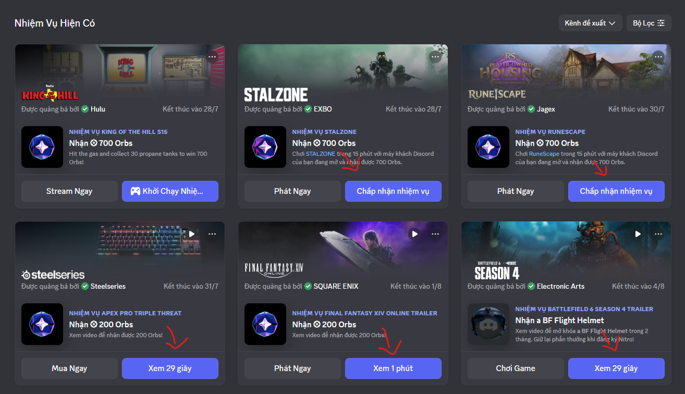

<h4 class="title_stuff">

**Bước 3:** Vào tab **Console** trên DevTools.
</h4>

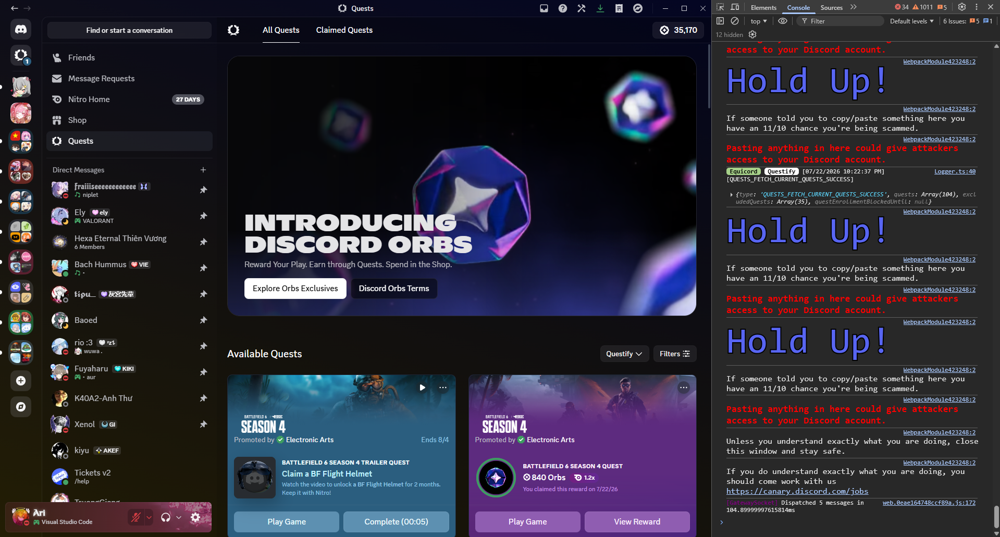

> *Trong trường hợp lần đầu tiếp xúc, trước hết hãy gõ `allow pasting` và nhấn enter để có thể paste code thoải mái.*

Tiến hành paste đoạn code sau:

<details>
    <summary>Nhấn vào đây để xem code nè :3</summary>
<div>

> *Trong trường hợp code bên dưới không hoạt động, [nhấn vào đây](https://gist.github.com/aamiaa/204cd9d42013ded9faf646fae7f89fbb).*
```js
delete window.$;
let wpRequire = webpackChunkdiscord_app.push([[Symbol()], {}, r => r]);
webpackChunkdiscord_app.pop();

let ApplicationStreamingStore = Object.values(wpRequire.c).find(x => x?.exports?.A?.__proto__?.getStreamerActiveStreamMetadata).exports.A;
let RunningGameStore = Object.values(wpRequire.c).find(x => x?.exports?.Ay?.getRunningGames).exports.Ay;
let QuestsStore = Object.values(wpRequire.c).find(x => x?.exports?.A?.__proto__?.getQuest).exports.A;
let ChannelStore = Object.values(wpRequire.c).find(x => x?.exports?.A?.__proto__?.getAllThreadsForParent).exports.A;
let GuildChannelStore = Object.values(wpRequire.c).find(x => x?.exports?.Ay?.getSFWDefaultChannel).exports.Ay;
let FluxDispatcher = Object.values(wpRequire.c).find(x => x?.exports?.h?.__proto__?.flushWaitQueue).exports.h;
let api = Object.values(wpRequire.c).find(x => x?.exports?.Bo?.get).exports.Bo;

const supportedTasks = ["WATCH_VIDEO", "PLAY_ON_DESKTOP", "STREAM_ON_DESKTOP", "PLAY_ACTIVITY", "WATCH_VIDEO_ON_MOBILE"]
let quests = [...QuestsStore.quests.values()].filter(x => x.userStatus?.enrolledAt && !x.userStatus?.completedAt && new Date(x.config.expiresAt).getTime() > Date.now() && supportedTasks.find(y => Object.keys((x.config.taskConfig ?? x.config.taskConfigV2).tasks).includes(y)))
let isApp = typeof DiscordNative !== "undefined"
if(quests.length === 0) {
	console.log("You don't have any uncompleted quests!")
} else {
	let doJob = function() {
		const quest = quests.pop()
		if(!quest) return

		const pid = Math.floor(Math.random() * 30000) + 1000
		
		const applicationId = quest.config.application.id
		const applicationName = quest.config.application.name
		const questName = quest.config.messages.questName
		const taskConfig = quest.config.taskConfig ?? quest.config.taskConfigV2
		const taskName = supportedTasks.find(x => taskConfig.tasks[x] != null)
		const secondsNeeded = taskConfig.tasks[taskName].target
		let secondsDone = quest.userStatus?.progress?.[taskName]?.value ?? 0

		if(taskName === "WATCH_VIDEO" || taskName === "WATCH_VIDEO_ON_MOBILE") {
			const speed = 7
			const enrolledAt = new Date(quest.userStatus.enrolledAt).getTime()
			let completed = false
			let fn = async () => {			
				while(true) {
					const remaining = Math.min(speed, secondsNeeded - secondsDone)
					await new Promise(resolve => setTimeout(resolve, remaining * 1000))

					const timestamp = secondsDone + speed
					const res = await api.post({url: `/quests/${quest.id}/video-progress`, body: {timestamp: Math.min(secondsNeeded, timestamp + Math.random())}})
					completed = res.body.completed_at != null
					secondsDone = Math.min(secondsNeeded, timestamp)

					if(timestamp >= secondsNeeded) {
						break
					}
				}
				if(!completed) {
					await api.post({url: `/quests/${quest.id}/video-progress`, body: {timestamp: secondsNeeded}})
				}
				console.log("Quest completed!")
				doJob()
			}
			fn()
			console.log(`Spoofing video for ${questName}.`)
		} else if(taskName === "PLAY_ON_DESKTOP") {
			if(!isApp) {
				console.log("This no longer works in browser for non-video quests. Use the discord desktop app to complete the", questName, "quest!")
			} else {
				api.get({url: `/applications/public?application_ids=${applicationId}`}).then(res => {
					const appData = res.body[0]
					const exeName = appData.executables?.find(x => x.os === "win32")?.name?.replace(">","") ?? appData.name.replace(/[\/\\:*?"<>|]/g, "")
					
					const fakeGame = {
						cmdLine: `C:\\Program Files\\${appData.name}\\${exeName}`,
						exeName,
						exePath: `c:/program files/${appData.name.toLowerCase()}/${exeName}`,
						hidden: false,
						isLauncher: false,
						id: applicationId,
						name: appData.name,
						pid: pid,
						pidPath: [pid],
						processName: appData.name,
						start: Date.now(),
					}
					const realGames = RunningGameStore.getRunningGames()
					const fakeGames = [fakeGame]
					const realGetRunningGames = RunningGameStore.getRunningGames
					const realGetGameForPID = RunningGameStore.getGameForPID
					RunningGameStore.getRunningGames = () => fakeGames
					RunningGameStore.getGameForPID = (pid) => fakeGames.find(x => x.pid === pid)
					FluxDispatcher.dispatch({type: "RUNNING_GAMES_CHANGE", removed: realGames, added: [fakeGame], games: fakeGames})
					
					let fn = data => {
						let progress = quest.config.configVersion === 1 ? data.userStatus.streamProgressSeconds : Math.floor(data.userStatus.progress.PLAY_ON_DESKTOP.value)
						console.log(`Quest progress: ${progress}/${secondsNeeded}`)
						
						if(progress >= secondsNeeded) {
							console.log("Quest completed!")
							
							RunningGameStore.getRunningGames = realGetRunningGames
							RunningGameStore.getGameForPID = realGetGameForPID
							FluxDispatcher.dispatch({type: "RUNNING_GAMES_CHANGE", removed: [fakeGame], added: [], games: []})
							FluxDispatcher.unsubscribe("QUESTS_SEND_HEARTBEAT_SUCCESS", fn)
							
							doJob()
						}
					}
					FluxDispatcher.subscribe("QUESTS_SEND_HEARTBEAT_SUCCESS", fn)
					
					console.log(`Spoofed your game to ${applicationName}. Wait for ${Math.ceil((secondsNeeded - secondsDone) / 60)} more minutes.`)
				})
			}
		} else if(taskName === "STREAM_ON_DESKTOP") {
			if(!isApp) {
				console.log("This no longer works in browser for non-video quests. Use the discord desktop app to complete the", questName, "quest!")
			} else {
				let realFunc = ApplicationStreamingStore.getStreamerActiveStreamMetadata
				ApplicationStreamingStore.getStreamerActiveStreamMetadata = () => ({
					id: applicationId,
					pid,
					sourceName: null
				})
				
				let fn = data => {
					let progress = quest.config.configVersion === 1 ? data.userStatus.streamProgressSeconds : Math.floor(data.userStatus.progress.STREAM_ON_DESKTOP.value)
					console.log(`Quest progress: ${progress}/${secondsNeeded}`)
					
					if(progress >= secondsNeeded) {
						console.log("Quest completed!")
						
						ApplicationStreamingStore.getStreamerActiveStreamMetadata = realFunc
						FluxDispatcher.unsubscribe("QUESTS_SEND_HEARTBEAT_SUCCESS", fn)
						
						doJob()
					}
				}
				FluxDispatcher.subscribe("QUESTS_SEND_HEARTBEAT_SUCCESS", fn)
				
				console.log(`Spoofed your stream to ${applicationName}. Stream any window in vc for ${Math.ceil((secondsNeeded - secondsDone) / 60)} more minutes.`)
				console.log("Remember that you need at least 1 other person to be in the vc!")
			}
		} else if(taskName === "PLAY_ACTIVITY") {
			const channelId = ChannelStore.getSortedPrivateChannels()[0]?.id ?? Object.values(GuildChannelStore.getAllGuilds()).find(x => x != null && x.VOCAL.length > 0).VOCAL[0].channel.id
			const streamKey = `call:${channelId}:1`
			
			let fn = async () => {
				console.log("Completing quest", questName, "-", quest.config.messages.questName)
				
				while(true) {
					const res = await api.post({url: `/quests/${quest.id}/heartbeat`, body: {stream_key: streamKey, terminal: false}})
					const progress = res.body.progress.PLAY_ACTIVITY.value
					console.log(`Quest progress: ${progress}/${secondsNeeded}`)
					
					await new Promise(resolve => setTimeout(resolve, 20 * 1000))
					
					if(progress >= secondsNeeded) {
						await api.post({url: `/quests/${quest.id}/heartbeat`, body: {stream_key: streamKey, terminal: true}})
						break
					}
				}
				
				console.log("Quest completed!")
				doJob()
			}
			fn()
		}
	}
	doJob()
}
```
</div>
</details>

<h4 class="title_stuff">

**Bước 4:** Tiến hành đợi script tự hoàn thành quest, sau đó nhận Orbs thôi :D
</h4>

> ***Lưu ý:** Cách này chỉ có thể được áp dụng cho các quest như `WATCH_VIDEO`, `PLAY_ON_DESKTOP`, `STREAM_ON_DESKTOP`, `PLAY_ACTIVITY`, `WATCH_VIDEO_ON_MOBILE`. Không thể áp dụng cho một số quest đặc biệt khác (buồn dễ sợ 😭).*

### 2. Equicord + Questify Plugin (Nâng cao)

👏 Nếu bạn đã quá ngấy với script của **aamiaa** và cực kì lười để hoàn thành các quest đặc biệt mà không thể dùng được script trên, hãy đến với plugin toàn năng: **Questify**.

#### Giới thiệu chung

**Equicord** là một **client mod cho Discord**, được phát triển dựa trên mã nguồn của **Vencord**. Nó bổ sung hệ thống plugin và các tùy chỉnh mà Discord chính thức không có. **Questify** là một trong số các plugin mà **Equicord** hỗ trợ, dùng để quản lý và tùy chỉnh tính năng **Discord Quests** trên Discord.

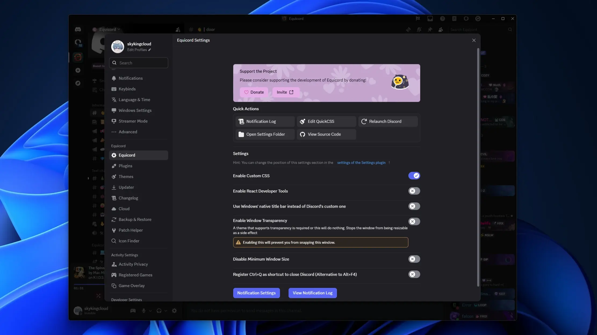

> **Questify** có 3 nhóm chức năng chính:
> - **Cải thiện khu vực Quest:** Hiển thị, sắp xếp và theo dõi tiến độ thuận tiện hơn.
> - **Ẩn một số chi tiết:** quảng cáo, banner, huy hiệu hoặc thông báo liên quan đến Quest.
> - **Tắt hoàn toàn Quest:** loại bỏ hệ thống Quest khỏi giao diện Discord nếu bạn không cần đến.
>
> Ngoài ra, **Questify** cũng hỗ trợ khả năng **tự động hóa tiến độ Quest** cho toàn bộ các kiểu quest khác nhau.

#### Hướng dẫn chi tiết

<h4 class="title_stuff">

**Bước 1:** Tải và cài đặt Equicord.
</h4>

Truy cập vào trang [https://equicord.org/download](https://equicord.org/download) và tải phiên bản cho hệ điều hành của bạn (chọn **GUI** nhé mấy ní >.<).

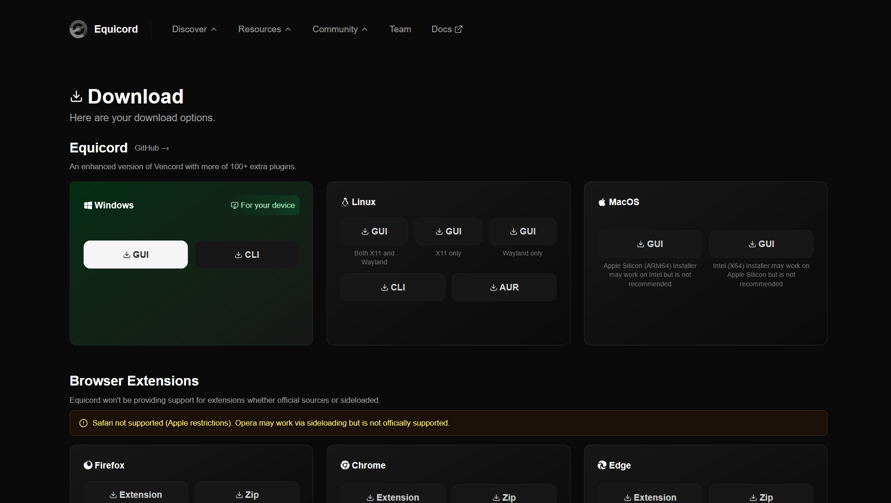

> *Bên dưới tui hướng dẫn cho Windows á, mấy con vợ dùng hệ điều hành khác chắc cũng tương tự thôi :D*

Tiến hành bật file vừa tải về, sau khi bật sẽ có giao diện như ảnh bên dưới:

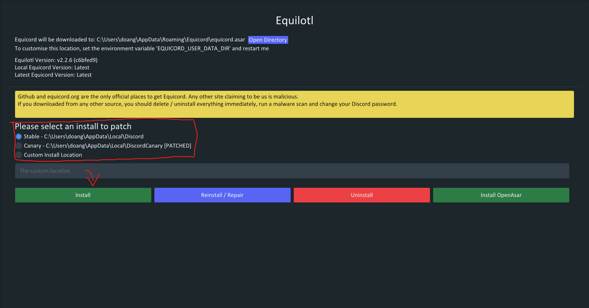

Chọn phiên bản Discord mà bạn muốn cài đặt **Equicord** - với người dùng bình thường mặc định là **Stable**, sau đó nhấn nút **Install** để patch. Bạn hãy chờ đến khi có thông báo sau:

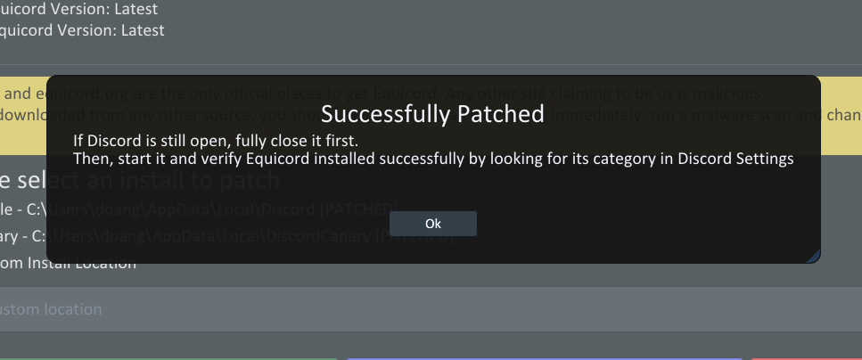

Vậy là đã cài đặt xong 👏👏👏. Đến bước tiếp theo thôi!

<h4 class="title_stuff">

**Bước 2:** Bật và tùy chỉnh cài đặt plugin **Questify**.
</h4>

Vào việc luôn! Bật app Discord của bạn lên, vào phần cài đặt, để ý sẽ thấy khu vực **Equicord Settings**, chọn tab **Plugins**.

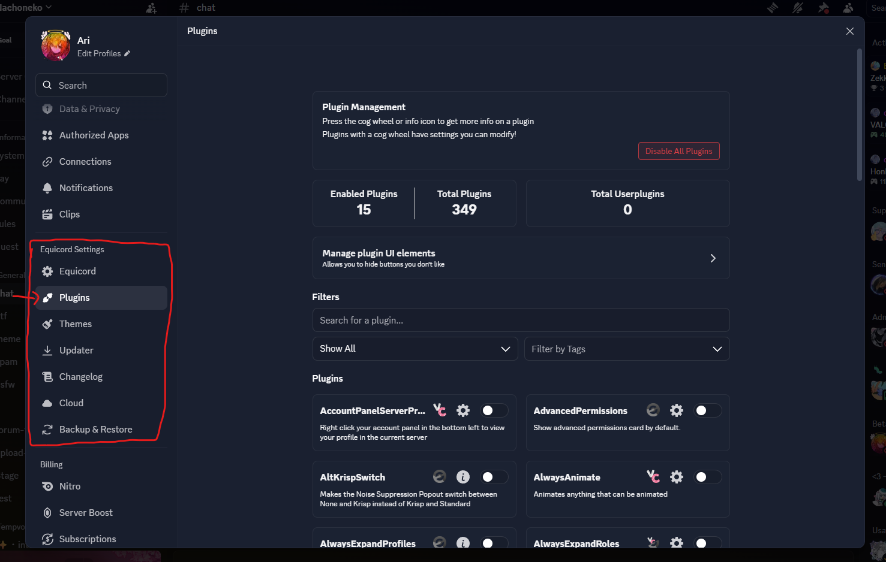

Làm theo trình tự sau: Tìm kiếm `Questify` -> Nhấn nút bật plugin -> Nhấn icon **Cài đặt**.

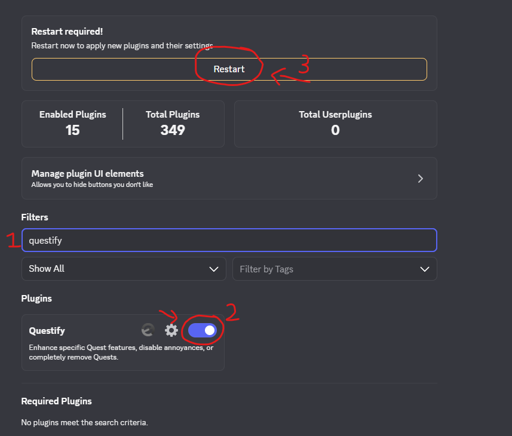

Tại cửa sổ cài đặt plugin **Questify**, ta chú ý đến phần có nền đỏ. Hãy tiến hành bật hết tất cả các chức năng, riêng phần **`Auto-complete specific Quest types`** chọn tất cả các **Quest type**.

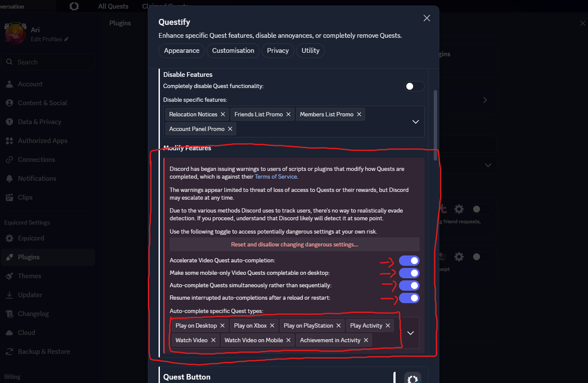
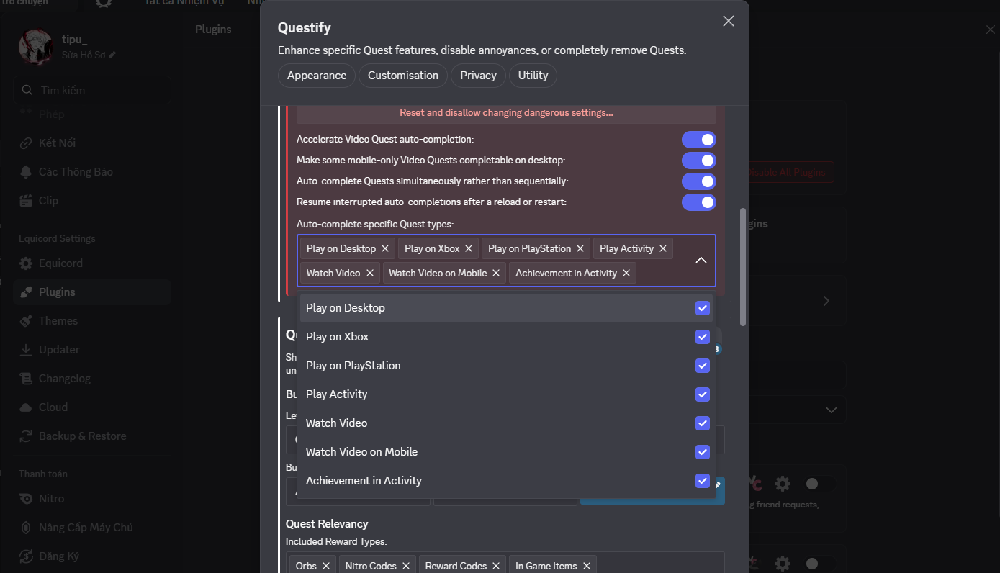

Sau đó thoát ra ngoài, khởi động lại Discord 🤑...

<h4 class="title_stuff">

**Bước 3:** Tự động hoàn thành **Quest**!!
</h4>

Vào khu vực **Quest**, click vào nút **Complete** bất kì để tự động hoàn thành.

> **Lợi ích:**
> - *Bạn có thể thực hiện nhiều Quest cùng một lúc, điều mà script của aamiaa không thể làm được.*
> - *Các quest hiện nút **Complete Now** sẽ có thời gian hoàn thành gần như ngay lập tức.*

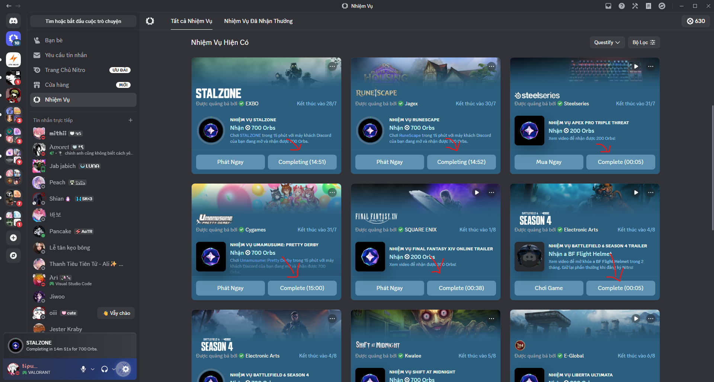

Ngon, đỡ tốn thời gian 🗣️🔥🔥🔥🔥. Giờ đến mục tiếp theo thôi!

### 3. Bot/Website hoàn thành Quest tự động (Rủi ro cao)

Mình không khuyến khích các bạn thực hiện cách này (trừ khi chính bạn là người viết bot/website). Bởi để **Discord Bot/Website** hoàn thành quest tự động, bạn sẽ phải gửi **token** tài khoản của bản thân. Việc này rất nguy hiểm bởi token gần như là **"chìa khóa đăng nhập"** vào tài khoản Discord của bạn. Nếu gửi token cho một bot hoặc website không đáng tin cậy, kẻ xấu có thể chiếm quyền tài khoản, đọc tin nhắn, gửi spam, tham gia máy chủ hoặc thực hiện các hành vi vi phạm thay bạn. Vì vậy, tuyệt đối không chia sẻ token cho bất kỳ ai.

*u know, người thông minh không ai giao credentials tài khoản cá nhân cho một bên không rõ nguồn gốc cả...* 😎

## Kiếm thêm nhiều Quest bằng VPN

> *Cẩn thận bị ăn rate limit/temp ban đấy nhé mấy con vợ >.<*

Hết Quest để làm rồi à... chán nhỉ? À! Fun fact là **Discord** còn cung cấp các Quest riêng biệt cho một số quốc gia nữa đấy :D.

Vậy làm thế nào để chúng ta có thể nhận Quest từ các quốc gia ấy nhỉ? 🤔

### 1. Có sẵn phần mềm VPN/Fake IP

Để nhận Quest của các quốc gia khác, theo logic đơn giản thì ta sẽ phải ở quốc gia đó rồi đúng không? Tuy nhiên vì đây Internet nên chúng ta có thể **"fake"** rằng bản thân đang ở quốc gia đấy 🐧. Để thực hiện được điều này, ta cần can thiệp vào **địa chỉ IP public**, cụ thể bạn sẽ phải sử dụng các **phần mềm VPN**.

> **VPN (Virtual Private Network - mạng riêng ảo)** là công nghệ giúp tạo một đường truyền được mã hóa giữa thiết bị của bạn và Internet, qua đó tăng bảo mật, **"che địa chỉ IP thật"** và có thể giúp **"truy cập nội dung bị giới hạn theo khu vực"**. Các **phần mềm VPN** cho phép bạn làm điều đó một cách dễ dàng.

Các phần mềm VPN phổ biến hiện nay gồm **NordVPN, ExpressVPN, Surfshark, Proton VPN** và **Urban VPN**. Trong đó NordVPN, ExpressVPN và Surfshark chủ yếu là dịch vụ trả phí, còn Proton VPN và Urban VPN có gói miễn phí.

### 2. Xác định Quest riêng ở các quốc gia

Vậy là bạn đã có một chiếc app VPN xịn xò 😎, thế nhưng bạn lại không biết ở quốc gia nào sẽ có Quest riêng?! Bạn tự hỏi mình sẽ xác định kiểu gì nhỉ? Chả nhẽ lại đi thử từng quốc gia một để check à... 😭

Để giải quyết nhu cầu trên, bạn của chủ blog - **Bach Hummus** đã tạo ra một con bot dùng để tự động track các Quest mới ở tất cả các quốc gia. Quest ở quốc gia nào sẽ được thông báo định kì ở máy chủ Discord [**Vietnam 🇻🇳**](https://discord.gg/vietnam-1369110877231513771) (kênh `📬・track-nhiệm-vụ`).

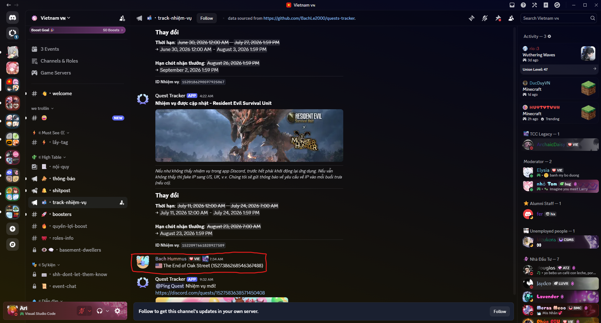

<iframe src="https://drive.google.com/file/d/1xc2gxh5ke-kOpmrlJyduPmOGhGP5UzqK/preview" class="w-full h-[300px] md:h-[500px]"></iframe>

Việc còn lại là hoàn thành các Quest và nhận Orbs thôi. 🥰

# Bounty (Discord Mobile)

**Discord Bounty** nôm na là một dạng **nhiệm vụ quảng cáo** dành cho ứng dụng Discord trên điện thoại. Bạn phải xem các video quảng cáo được tài trợ để nhận được số lượng Orbs nhất định (hiện là **50 Orbs** mỗi nhiệm vụ). Các nhiệm vụ sẽ được cập nhật trong một khoảng thời gian ngắn, thường là **1-2 ngày**. Đây là một trong số cách mới để kiếm thêm Orbs gần đây 🤑🤑.

> *Hiện không có cách nào để tự động hoàn thành các Quest này do khác biệt về API giữa Quest thường và Bounty.*

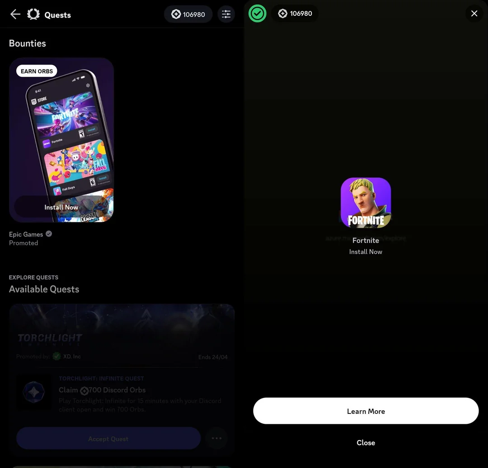

# Kết bài

Vậy là chúng ta đã đi qua kha khá cách để kiếm **Discord Orbs**: từ dùng script của **aamiaa** cho các Quest cơ bản, tận dụng **Equicord + Questify** để xử lý nhiều loại Quest tiện hơn, cho đến săn thêm nhiệm vụ theo khu vực bằng **VPN** và tranh thủ làm **Bounty** trên điện thoại. Tùy nhu cầu mà bạn có thể chọn cách phù hợp - không nhất thiết phải bật full combo đâu nhé :D.

Dù Orbs và các món đồ trong Shop khá hấp dẫn (nhất là **Nitro** heheehehehhehehe), bạn vẫn nên nhớ rằng script, client mod hay việc thay đổi IP đều không phải tính năng chính thức được Discord bảo đảm an toàn. Đừng paste những đoạn code không rõ nguồn gốc, không chia sẻ token tài khoản và cũng đừng spam đổi VPN liên tục kẻo chưa kịp làm phú ông đã được Discord cho "nghỉ dưỡng" 😭.

Hy vọng những mẹo trong bài sẽ giúp bạn tiết kiệm được kha khá thời gian và không bỏ lỡ các Quest ngon vờ lờ 🐧. Chúc các bạn cày Orbs vui vẻ, đổi được đúng món mình thích - và quan trọng nhất là **cày có chừng mực, an toàn là trên hết** nhé! 🥰

