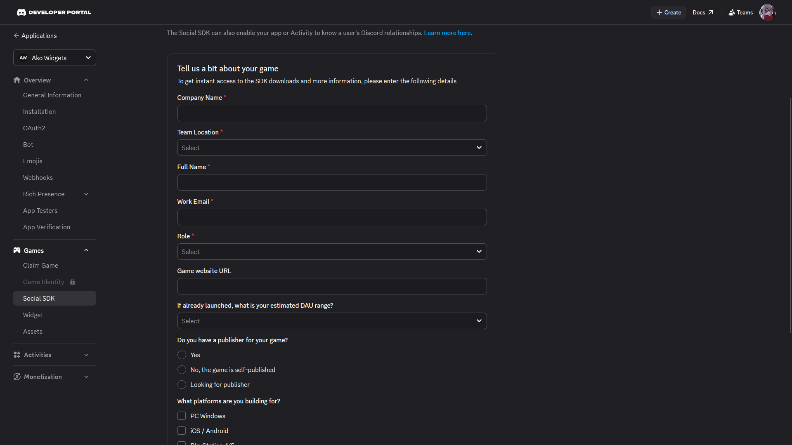
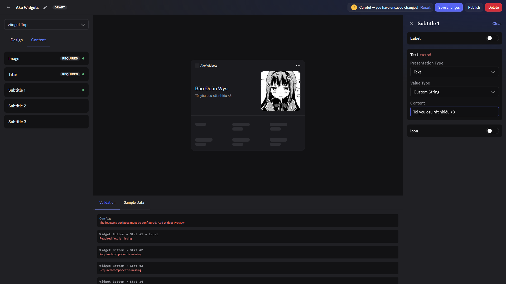
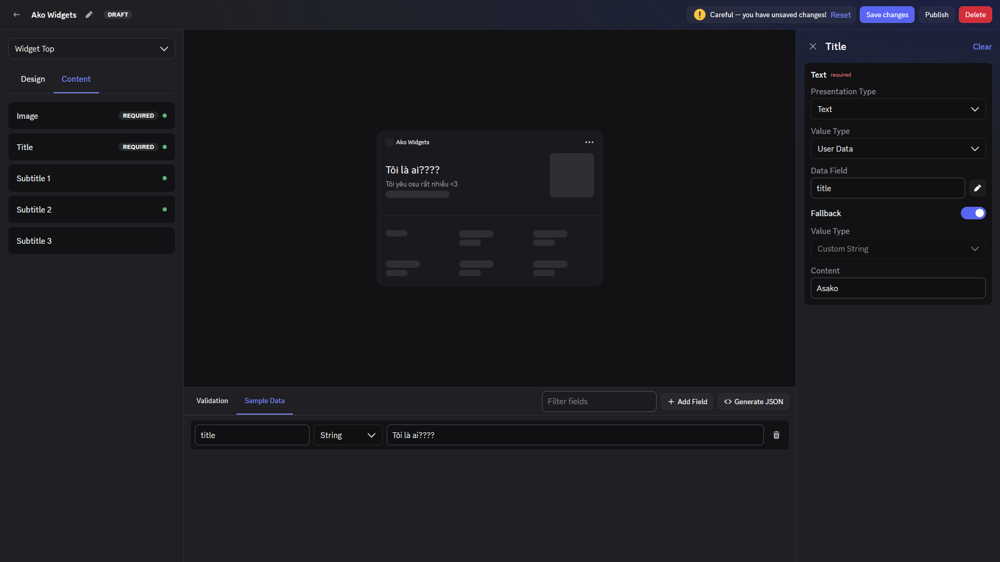
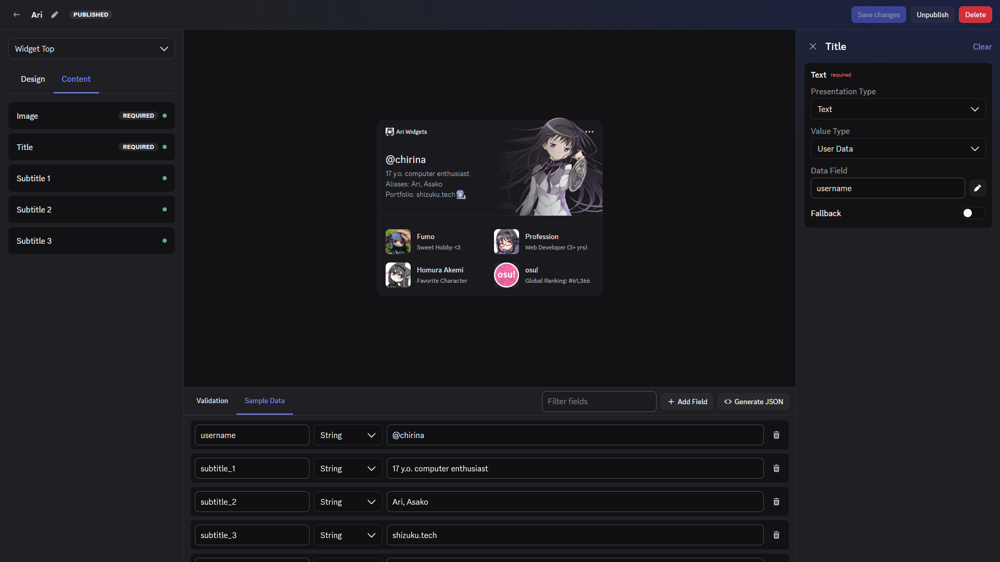
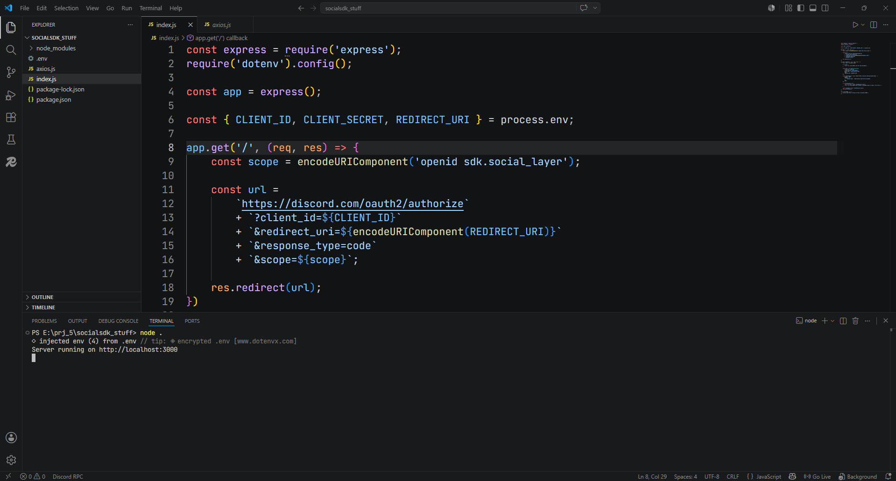
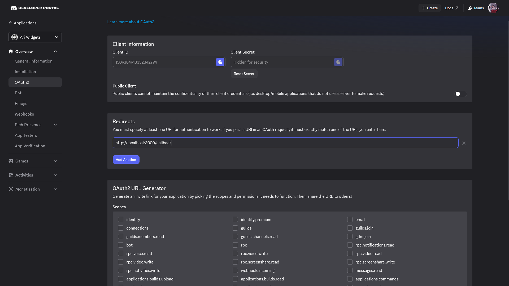
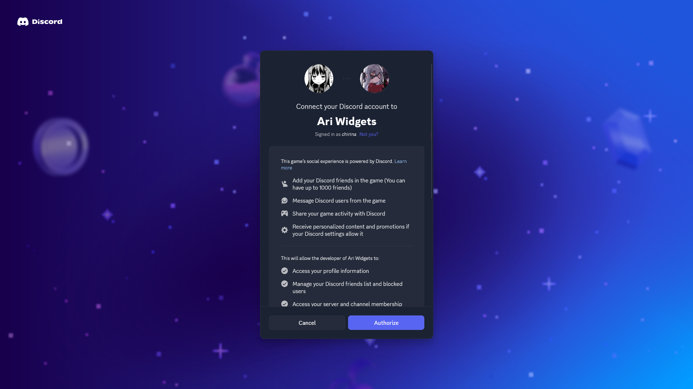
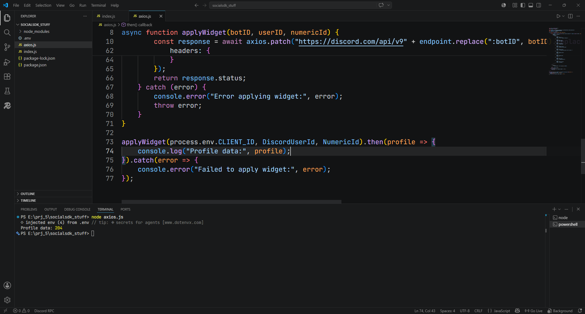
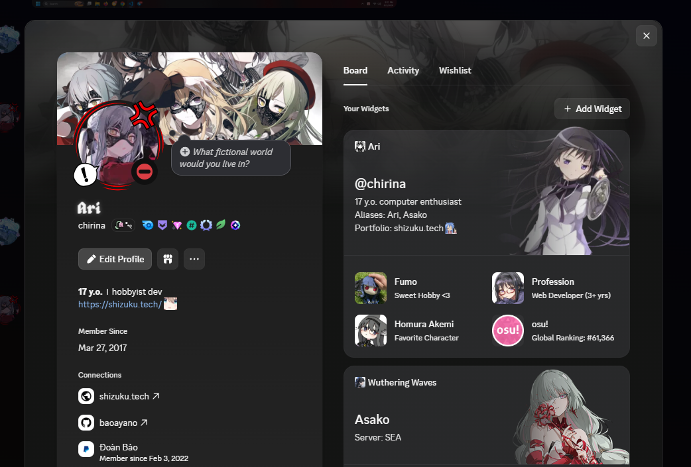

> **Lưu ý:** 
> - Cách mình hướng dẫn không hẳn là cách tốt nhất mà nhưng cơ bản là vẫn thực hiện được.
> - Discord sẽ sớm release **official documentation** về tính năng này trong thời gian tới, vì vậy hãy thực hiện trò này sớm trước khi nó không còn hoạt động 🐧.

Thời gian gần đây, Discord đã ra mắt tính năng Profile Widget, nhưng bạn không thể tùy chỉnh nó theo ý muốn mà phải phụ thuộc vào các ứng dụng và trò chơi được liên kết. Trong bài viết này, mình sẽ chia sẻ cách tạo một Profile Widget custom bằng cách tận dụng một số thủ thuật thú vị mà Discord hiện vẫn hỗ trợ.

# Tạo Discord Application và Setup

Đầu tiên, bạn hãy tiến hành truy cập vào [Discord Developer Portal](https://discord.com/developers/home) và tiến hành tạo cho mình một application mới. Nhấn nút **Create** -> **Create blank app** -> Điền tên app và nhấn **Create**. Sau khi vào cửa sổ app của bạn, tìm mục **Games** và chọn **Social SDK**.



Tại đây bạn có thể điền bất kì thông tin gì bạn muốn, sau đó hãy click **Submit** để xác nhận (bạn sẽ có quyền truy cập ngay lập tức thôi yên tâm 🥀). Sau đó hãy vào DevTools (F12), vào console và nhập đoạn code sau:

```javascript
let wreq = webpackChunkdiscord_developers.push([[Symbol()],{},r=>r]);
let _mods =  Object.values(wreq.c)
let findByProps = (...props) => {
    for (let m of _mods) {
        try {
            if (!m.exports || m.exports === window) continue;
            if (props.every((x) => m.exports?.[x])) return m.exports;

            for (let ex in m.exports) {
                if (props.every((x) => m.exports?.[ex]?.[x]) && m.exports[ex][Symbol.toStringTag] !== 'IntlMessagesProxy') return m.exports[ex];
            }
        } catch {}
    }
}

findByProps("getAll").getAll().find(e=>e.getName() === "ApexExperimentStore").createOverride("2026-03-application-assets-manager", 1)
findByProps("getAll").getAll().find(e=>e.getName() === "ApexExperimentStore").createOverride("2026-03-widget-config-editor", 1)
```

Sau khi sử dụng xong, hãy thoát ra vào lại application của bạn (sử dụng cái nút có mũi tên ở bên trên ấy, không phải tải lại trang đâu, bạn cực kì thông minh mà 😎). Sau khi vào lại application, bạn sẽ thấy ở mục **Games** xuất hiện thêm 2 tab: **Widget** và **Assets**. 

# Tạo Widget của riêng bạn

Hãy click vào tab **Widget** và nhấn nút **Create Widget**. Sau đó, bạn sẽ được đưa đến cửa sổ **Widget Editor** với đầy đủ các chức năng. Mặc dù việc thiết kế khá đơn giản, tuy vậy vẫn còn một số điều mình cần giải thích để tránh gặp khó khăn trong quá trình thiết kế.

Thứ nhất, bạn cần phải tạo đầy đủ các phần như **Widget Top**, **Widget Bottom** và **Widget Preview**, cũng như phải điền đầy đủ tất cả các trường thông tin cho từng phần.



Đại loại, các trường liên quan đến hình ảnh thường sẽ có 2 type: **Application Asset** và **User Data**, các trường liên quan đến text sẽ có 2 type: **Custom String** và **User Data** và kiểu dữ liệu **Text** hoặc **Number**. Ví dụ: mình set type **Application Asset**, tức là mình sẽ upload và sử dụng ảnh đó cho widget và mọi người sử dụng widget của mình đều phải sử dụng ảnh đó. Tương tự với type **Custom String**, mọi người sử dụng widget sẽ có chung text hiển thị mà không thể tùy chỉnh. Vì vậy mình khuyên nếu bạn chỉ có nhu cầu sử dụng widget này cho bản thân, bạn có thể cân nhắc dùng 2 type này.

Ngược lại, nếu bạn có nhu cầu tùy chỉnh widget sao cho phù hợp với nhiều người dùng (giống widget của game), hãy sử dụng type **User Data** và trường **Data Field**. Khi bạn sử dụng type này, bạn có thể thoải mái điều chỉnh thông tin sao cho phù hợp với từng người dùng bằng API với body JSON (*người dùng cơ bản có thể không cần quan tâm đến chỗ này 👏*).



Để điều chỉnh hiển thị với JSON khi bạn set type **User Data**, hãy để ý đến thanh có dòng **Validation** và **Sample Data**. Click chọn **Sample Data**, nó sẽ hiển thị cho bạn 1 vùng để bạn điều chỉnh JSON data với key và value. Hãy thử nhập một cái gì đấy vào trường **Data Field**, sau đó nhấn **Add Field** ở **Sample Data**, nhập dữ liệu **Key** (**Data Field** bạn nhập trước đó) và **Value** (dữ liệu hiển thị mẫu). Bạn sẽ thấy trên layout widget xuất hiện dòng **Value** mà bạn vừa nhập. Để export JSON data mà bạn đã chỉnh sửa, nhấn nút **Generate JSON** và lưu nó ở đâu đó vì bạn sẽ cần chúng. Hãy cân nhắc sử dụng **Fallback** trong trường hợp dữ liệu người dùng không sẵn có.



Chà... Có vẻ mọi thứ ổn rồi nhỉ? Hãy nhấn vào nút **Save Changes** và **Publish** phía trên để lưu và xác nhận hiển thị toàn bộ mọi thứ.

# Xác thực người dùng và hiển thị Widget

Chúc mừng bạn đã thiết kế xong Custom Widget tuyệt đẹp của bản thân 👏👏👏. Nó vẫn chưa hiển thị trên profile của bạn à 🐧. Ồ! Người thông minh như bạn sẽ biết rằng phải làm thêm một số bước nữa để nó có thể hiển thị trên cái profile của bản thân nhỉ :D. Hãy tạo một con bot trên application hiện tại của bạn (nếu bạn không biết thì tự xem Youtube nhé, đầy người làm rồi). Copy **Client ID**, **Client Secret** và **Bot Token** của bot và lưu ở đâu đấy vì bạn sẽ cần dùng đến nó đấy.

Một số người sẽ chọn viết mã nguồn cho bot, sau đó sử dụng slash command để làm mọi thứ. Haizzzz... làm vậy rườm rà quá. Hãy tạo một thư mục trên máy tính, mở code editor của bạn lên bằng thư mục đó (ở đây mình dùng **Visual Studio Code**). Tạo file `index.js`, sau đó lên terminal và sử dụng 2 lệnh sau:

```bash
npm init -y
npm i express dotenv axios
```

Đợi lệnh chạy xong thì tạo file `.env`, bên trong điền các thông tin như sau:

```properties
CLIENT_ID=client id của bot
CLIENT_SECRET=client secret của bot
REDIRECT_URI=http://localhost:3000/callback
TOKEN=token của bot
```

Sau đó vào file `index.js`, paste đoạn code sau vào:

```javascript
const express = require('express');
require('dotenv').config();

const app = express();

const { CLIENT_ID, CLIENT_SECRET, REDIRECT_URI } = process.env;

app.get('/', (req, res) => {
    const scope = encodeURIComponent('openid sdk.social_layer');

    const url = 
        `https://discord.com/oauth2/authorize`
        + `?client_id=${CLIENT_ID}`
        + `&redirect_uri=${encodeURIComponent(REDIRECT_URI)}`
        + `&response_type=code`
        + `&scope=${scope}`;

    res.redirect(url);
})

app.get('/callback', async (req, res) => {
    const code = req.query.code;
    
    if (!code) {
        return res.status(400).send('No code provided');
    }

    const body = new URLSearchParams({
        client_id: CLIENT_ID,
        client_secret: CLIENT_SECRET,
        grant_type: 'authorization_code',
        code,
        redirect_uri: REDIRECT_URI,
    });

    const tokenResponse = await fetch('https://discord.com/api/oauth2/token', {
        method: 'POST',
        headers: {
            'Content-Type': 'application/x-www-form-urlencoded',
        },
        body,
    });

    if (!tokenResponse.ok) {
        const errorText = await tokenResponse.text();
        return res.status(500).send(`Failed to exchange code for token: ${errorText}`);
    }

    const tokenData = await tokenResponse.json();
    res.json(tokenData);
});

app.listen(3000, () => {
    console.log('Server running on http://localhost:3000');
});
```
Giờ hãy lên terminal, gõ `node .`, bấm enter và bạn đã có một server web chạy trên máy 👏.



Sau đó bạn hãy vào lại trang portal, vào phần **Overview** và chọn **OAuth2**. Hãy điền đường dẫn `http://localhost:3000/callback` vào mục **Redirects** và lưu lại.



Có vẻ ổn rồi nhỉ. Giờ hãy truy cập vào đường dẫn `http://localhost:3000`, bạn sẽ được chuyển thẳng đến trang xác thực quyền truy cập của application với tài khoản Discord của bạn.



Sau khi xác thực xong, bạn hãy vào lại code editor, tạo thêm một file `axios.js`, sau đó paste đoạn code sau:

```javascript
const axios = require('axios');
require('dotenv').config();

const endpoint = "/applications/:botID/users/:userID/identities/:numericId/profile";
const DiscordUserId = "discord id của bạn";
const NumericId = "một cái gì đấy";

async function applyWidget(botID, userID, numericId) {
    try {
        const response = await axios.patch("https://discord.com/api/v9" + endpoint.replace(":botID", botID).replace(":userID", userID).replace(":numericId", numericId), {
            // phần này là JSON data bạn đã export dành cho "User Data" type
            // bạn có thể tùy chỉnh phần này cho application riêng mà bạn code chẳng hạn :)
        }, {
            headers: {
                "Authorization": `Bot ${process.env.TOKEN}`,
            }
        });
        return response.status;
    } catch (error) {
        console.error("Error applying widget:", error);
        throw error;
    }
}

applyWidget(process.env.CLIENT_ID, DiscordUserId, NumericId).then(profile => {
    console.log("Profile data:", profile);
}).catch(error => {
    console.error("Failed to apply widget:", error);
});
```

Sửa chỗ `DiscordUserId` thành Discord ID của bạn, riêng `NumericId` là trường phân biệt widget cho mỗi người dùng (với người dùng cơ bản thì bạn có thể điền cái này tùy thích). Sau đó lên terminal, gõ `node axios.js` và enter. Nếu bạn thấy dòng sau:

```
Profile data: 204
```

Vậy là ngon rồi, bạn đã apply thành công widget lên tài khoản Discord của mình. Yippe!

*it should be 200 for the first time, but it always shows 204. lol, who knows xD*



# Khoan đã! Bạn tưởng đã xong rồi sao?

Ố?! Sao vẫn chưa có widget trên profile nữa 🐟. À! Còn một bước cuối cùng để hiển thị widget trên profile của bạn đây!!

Ở một bản patch gần đây, Discord đã thay đổi một số thứ khá khó chịu khiến cho bạn không thể add widget trực tiếp ở mục chỉnh widget trên profile mà phải sử dụng đến API. Bật DevTools (Ctrl + Shift + I) trên Discord lên, vào console nhập đoạn code sau:

```javascript
let _mods=webpackChunkdiscord_app.push([[Symbol()],{},e=>e.c]);webpackChunkdiscord_app.pop();
let findByProps=(...e)=>{for(let t of Object.values(_mods))try{if(!t.exports||t.exports===window)continue;if(e.every(e=>t.exports?.[e]))return t.exports;for(let r in t.exports)if(e.every(e=>t.exports?.[r]?.[e])&&"IntlMessagesProxy"!==t.exports[r][Symbol.toStringTag])return t.exports[r]}catch{}};

api = findByProps("Bo", "Cu").Bo
async function addWidget(appId) {
    id = findByProps("getCurrentUser").getCurrentUser().id;
    current_widgets = (await api.get("/users/" + id + "/profile")).body.widgets
    if (current_widgets.map(x=>x.data?.application_id).includes(appId)) {return console.log("Already in your widgets — remove it via Discord client to re-add")}
    current_widgets.unshift({"data": {"type": "application","application_id": appId}})
    await api.put({url: "/users/@me/widgets",body:{widgets: current_widgets}})
}

addWidget("client id")
```
Thay chữ `client id` ở dưới cùng thành **Client ID** application của bạn, sau đó enter để chính thức apply widget 🤑.

*Nếu bạn không biết bật DevTools trên App Discord, tham khảo ở đây nhé: [Side Note: How to Enable DevTools in Discord](https://padraig.blog/side-note-how-to-enable-devtools-in-discord-on-macos/).*



Eheh, giờ bạn đã biết cách tạo Custom Widget rồi đấy! Đừng chia sẻ rộng rãi quá nhé >.<

## Kết bài
Một số code được cung cấp bởi **@bachhummus**, hi vọng anh ấy sẽ không giận vì tôi đã chia sẻ guide này lên blog 😁.

Nhớ đọc phần lưu ý trước khi thực hiện nhé!

Cảm ơn mọi người đã đọc, chúc mọi người thực hiện thành công <3