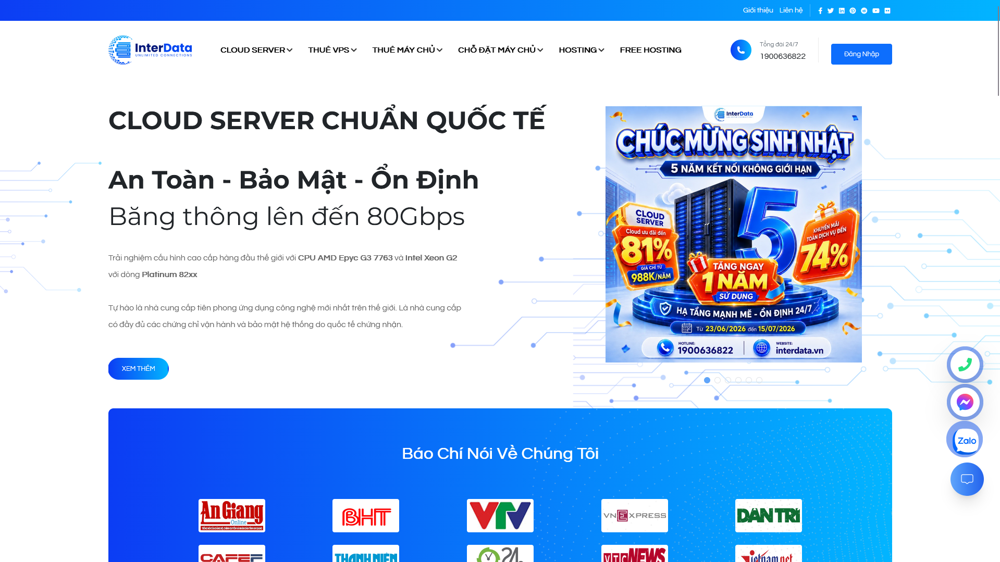
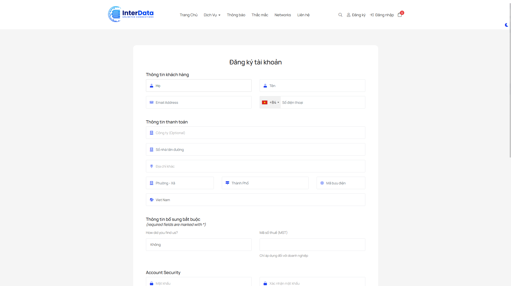
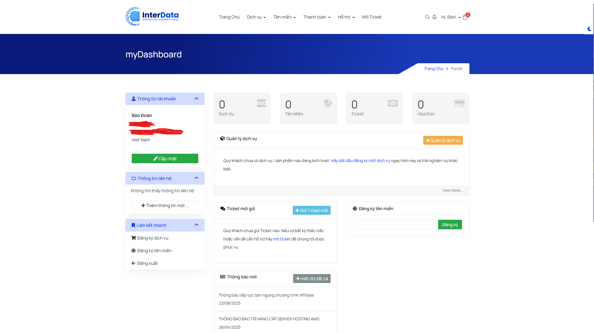
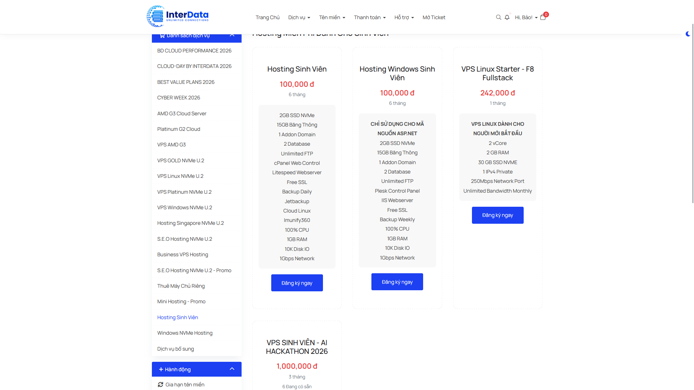
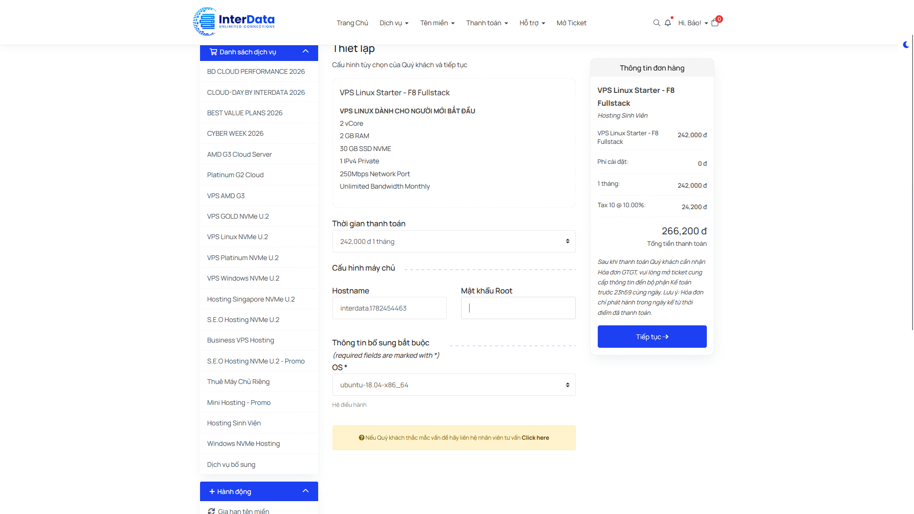
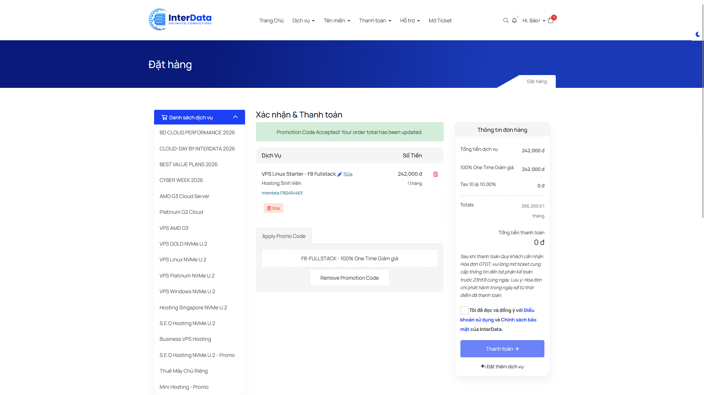
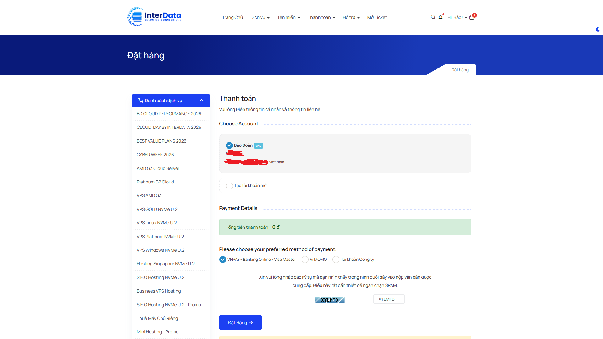
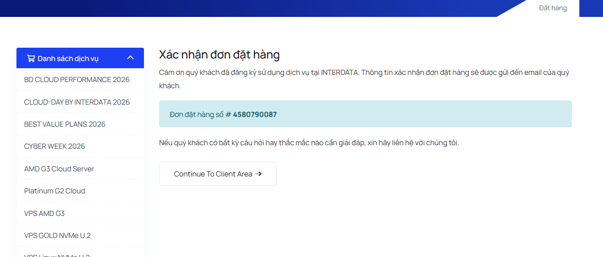
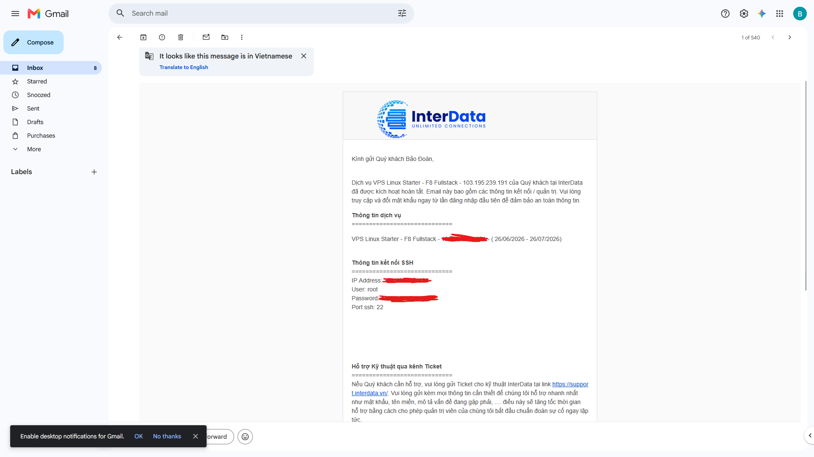

> ***Cập nhật 01/07/2026:** Offer này vẫn hoạt động bình thường.*

Trong quá trình phát triển khóa học **DevOps**, **F8** đã hợp tác với **InterData** nhằm mang đến cho học viên cơ hội trải nghiệm môi trường máy chủ thực tế ngay trong quá trình học tập. Thông qua chương trình hợp tác này, mỗi học viên đủ điều kiện sẽ được nhận một **VPS Linux miễn phí** trong vòng 1 tháng để thực hành các kiến thức về Linux, Docker, CI/CD, triển khai ứng dụng và nhiều nội dung khác trong lộ trình DevOps. Trong bài viết này, mình sẽ hướng dẫn chi tiết cách đăng ký và nhận VPS Linux miễn phí từ F8, đồng thời chia sẻ một số lưu ý quan trọng để bạn có thể kích hoạt và sử dụng máy chủ một cách nhanh chóng, hiệu quả nhất.

# Đăng ký tài khoản InterData

Đầu tiên, bạn hãy tiến hành truy cập trang web của **InterData** bằng đường dẫn sau: [https://interdata.vn](https://interdata.vn).



Tại phần trang chủ, bạn hãy click vào nút **Đăng nhập**. Sau khi bạn được chuyển hướng sang **Trang chủ** của trang hỗ trợ, hãy click tiếp vào nút **Đăng ký**, tiến hành điền đầy đủ thông tin của bạn và thực hiện xác minh email như bình thường.





Vậy là bạn đã đăng ký thành công tài khoản **InterData**, hãy chuyển sang bước tiếp theo.

# Tiến hành nhận VPS miễn phí

Tại trang **Client Area** (trang chuyển hướng sau khi bạn đăng ký tài khoản thành công), ở phần **Liên kết nhanh**, hãy click vào **Đăng ký dịch vụ**. Sau khi được chuyển đến trang đặt hàng, ở phần **Danh sách dịch vụ**, bạn hãy tìm và chọn **Hosting Sinh Viên**.



Nhấn nút **Đăng ký ngay** ở tùy chọn **VPS Linux Starter - F8 Fullstack**. Sau đó tiến hành thiết lập mật khẩu root và điều chỉnh phiên bản OS của **Ubuntu**. Khi hoàn thành, hãy bấm nút **Tiếp tục**.



Bạn sẽ được chuyển đến trang xác nhận thanh toán, lúc này bạn hãy nhập Promo Code sau để được giảm giá 100%:

```
F8-FULLSTACK
```



Nhấn vào ô chấp nhận điều khoản rồi bấm **Thanh toán**. Ở trang thanh toán, tiếp tục bấm **Đặt hàng**.





Vậy là bạn đã nhận thành công **VPS Linux 1 tháng** miễn phí! Toàn bộ thông tin về VPS sẽ được gửi về email của bạn với nội dung sau:



# Đăng nhập vào VPS để sử dụng

Ơ? Phần này mà cũng cần được hướng dẫn à... 🥀

Thôi thì, hãy chuyển sang post này để tìm hiểu nhé: [Hướng dẫn đăng nhập vào VPS Linux với giao thức SSH đơn giản](https://nhanhoa.com/tin-tuc/dang-nhap-vao-vps-linux.html).

# Lời kết

Toàn bộ hướng dẫn lần này đều lấy ý tưởng từ video khóa học DevOps của F8, mọi người có thể xem ở đây: [24. Hướng dẫn mua VPS miễn phí](https://www.youtube.com/watch?v=1g_KEYwjWRU).

Có một số khả năng offer này sẽ bị hạn chế trong tương lai do số lượng người đăng ký có thể tăng đột biến, vì vậy hãy nhận càng sớm càng tốt!

Cảm ơn mọi người đã đọc, chúc mọi người thực hiện thành công <3